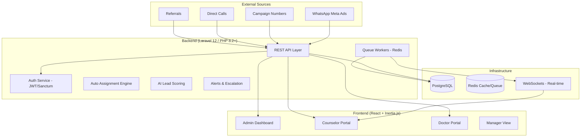
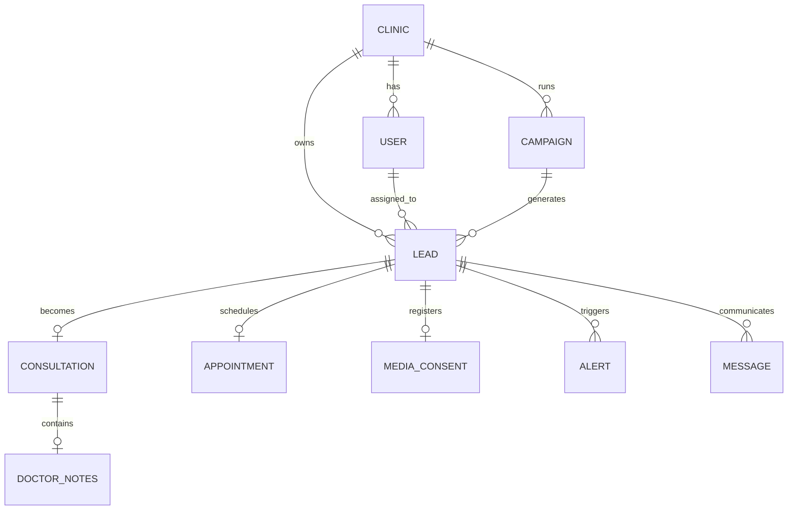

# Enterprise Clinic CRM - System Architecture & Deliverables

## 1. Overview
A full-stack, multi-tenant CRM designed for medical clinics to manage the complete patient journey from lead acquisition to post-consultation consent.

## 2. System Architecture Diagram


## 3. Entity Relationship (ER) Diagram


## 4. Full Database Schema (Planned)

### Core Multi-tenancy
- **clinics**: `id, name, slug, logo, settings (json), is_active, created_at, updated_at`

### User Management & RBAC
- **users**: `id, clinic_id, name, email, role (enum: admin, counselor, doctor, manager, superadmin), password, avatar, is_online, updated_at`

### Marketing & Growth
- **campaigns**: `id, clinic_id, name, type, budget, cost_per_lead, start_date, end_date, created_at`

### Lead Management
- **leads**: `id, clinic_id, campaign_id, counselor_id, name, phone, source, status, bmi, urgency, score, last_contacted_at, converted_at, created_at`
- **lead_activities**: `id, lead_id, user_id, description, type (status_change, note, call), payload (json), created_at`

### Clinical Workflow
- **appointments**: `id, clinic_id, lead_id, doctor_id, scheduled_at, duration, type, description, status (confirmed, cancelled, no-show)`
- **consultations**: `id, lead_id, doctor_id, scheduled_at, doctor_name, is_surgical_candidate, notes, attachments (json), created_at`
- **media_consents**: `id, lead_id, has_consented, is_success_story, media_manager_notified, signature_path, created_at`

### Automation & Real-time
- **alerts**: `id, clinic_id, lead_id, type, message, urgency, status (unread, dismissed), escalation_level, created_at`
- **messages**: `id, clinic_id, lead_id, user_id, body, type (whatsapp, sms, email), direction (in/out), created_at`

## 5. API Endpoints List

### Auth & User
- `POST /api/login`
- `GET /api/me`
- `GET /api/clinics/:id/users`

### Leads Pipeline
- `GET /api/leads` (list with filters)
- `POST /api/leads` (create/capture)
- `GET /api/leads/:id`
- `PATCH /api/leads/:id/status` (Pipeline drag-drop)
- `POST /api/leads/:id/assign` (Manual/Auto)

### Appointments
- `GET /api/appointments` (Calendar view)
- `POST /api/appointments`
- `PATCH /api/appointments/:id`

### Analytics & Reports
- `GET /api/reports/funnel`
- `GET /api/reports/campaigns`
- `GET /api/reports/counselors`

## 6. Frontend Module Architecture
```
resources/js/
├── Components/         # Reusable UI Atoms (Button, Input, Card)
├── Layouts/            # Authenticated vs Guest Layouts
├── Pages/
│   ├── Dashboard/      # Unified Dashboard with Role-based widgets
│   ├── Leads/          # Pipeline (Kanban), List, Detail Views
│   ├── Campaigns/      # Builder and ROI Analytics
│   ├── Appointments/   # Calendar and Scheduling
│   ├── Reports/        # Visual Analytics and Performance
│   ├── Settings/       # RBAC, Clinic Config
├── lib/                # Auth context, Utils, API clients
└── types/              # TypeScript Interfaces
```

## 7. Next Implementation Steps
1. **Multi-tenancy Refactor**: Add `clinic_id` to all relevant tables.
2. **Kanban Pipeline View**: Implement drag-and-drop for Lead statuses.
3. **Calendar Integration**: Add a scheduling module for Doctors.
4. **Auto-Assignment Logic**: Implement Round Robin in the background.
5. **Real-time Alerts**: Set up Laravel Echo for missed call/message notifications.
